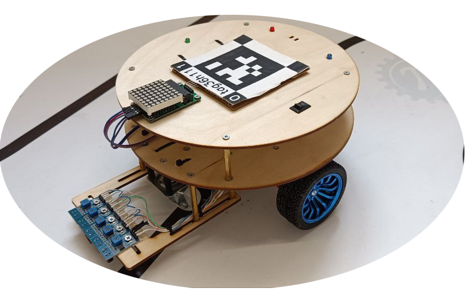

# Lesson 1. Test drive

## Lesson objective
Get started with the robot and get it moving immediately.

## Introduction
In this lesson, you will learn how to set the robot in motion. It's really not difficult, for this you only need a great desire and perseverance.

Below is a photo of the robot.



 Let's test the robot by writing a program for moving forward.

## Step-by-step Instructions
1. Copy the code provided below and paste it into the code editor.
```
#include <lineRobot.h>

void setup() {
  robot.moveForwardSeconds(3);
}

void loop(){
}
```
2. Upload the program to the robot.
3. You can see the result of the program execution in the output and on the video feed.


## Conclusion
Congratulations! You have successfully learned how to make the robot move! Now you can proceed to the next lesson!

