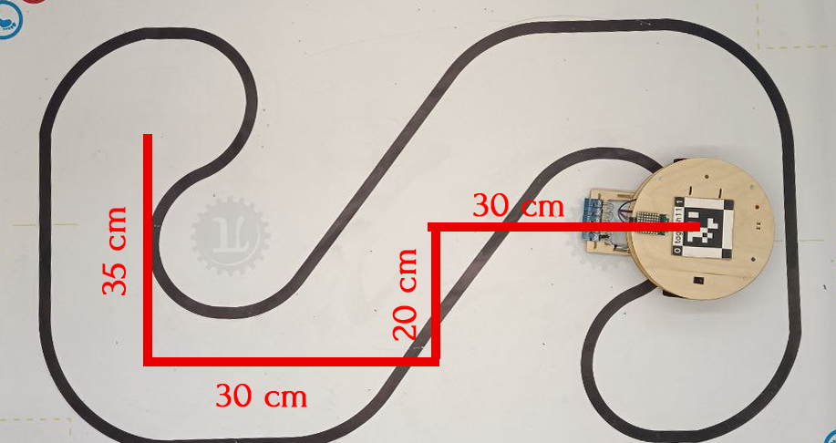

# Lesson 5. Long distance race

## Lesson objective
Write a program with a specific sequence of movements.

## Introduction
Now you know how to control the robot in four directions. In this lesson, you will need to write a sequence of commands in such a way that the robot follows a specified route.

## Block of theory
You've been writing programs for several lessons now. Let's define what a program is: program is a ordered sequence of commands.  Commands performs by executor. In our case, the executor of commands is the robot. 

Each function of the library `lineRobot` executes a sequence of commands within the function. In the upcoming lessons, you will write your own functions using the basic functions of the Arduino Wiring programming language.

## Task 
Write a program for the robot to follow the route represented in the image.

You can remember the library functions by revisiting the previous lessons.

## Conclusion
Congratulations! You have learned about the concept of a program and an executor. In the next lesson, you will learn how to control the robot's speed.