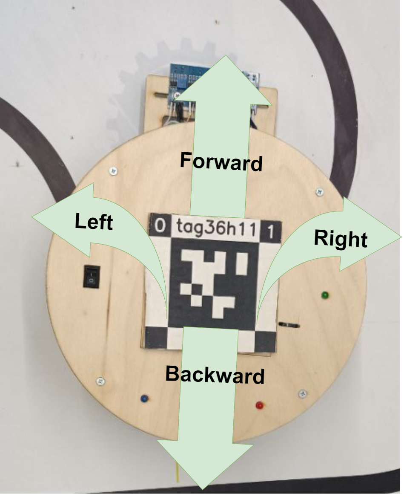

# Lesson 4. Maneuvering

## Lesson objective
Learn about functions for turning the robot right and left.

## Introduction
You have successfully learned how to control the robot's forward and backward movements, but this is not enough for free movement across the field. In this lesson, you will learn functions for turning right and left.

## Block of theory
You already know how to control the robot for straight movement, now let's learn about turning the robot right and left to move in four directions.

Below, the image represent the possible directions of the robot's movement.

`robot.turnRight()` - function for turning right.

`robot.turnLeft()` - function for turning left.

As you can see, the turning functions don't take any parameters. It's enough to call them, and the robot will turn in place in the desired direction.

## Task 
Write a program for the robot to turn right, then turn left, and finally turn left again.

## Conclusion
Congratulations! Now you can move the robot in four directions! This will be very useful for you in the next lesson.